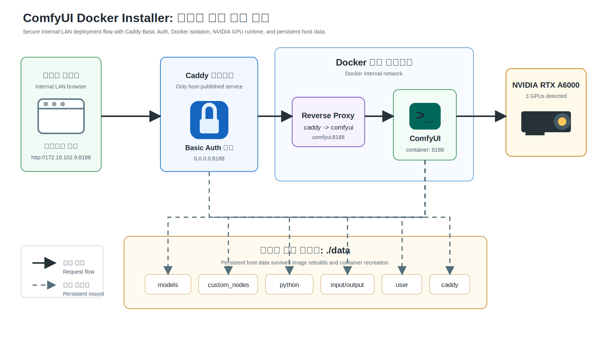
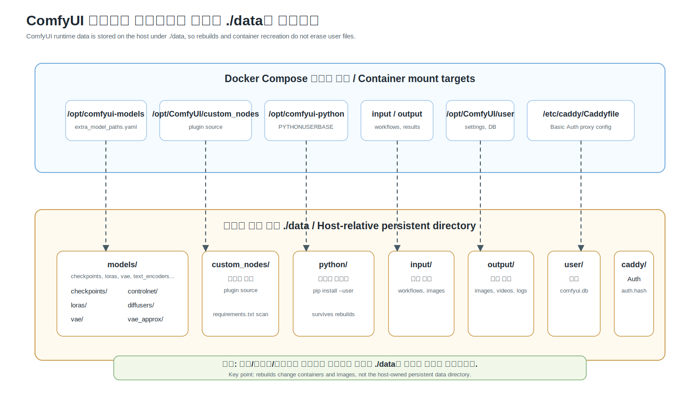

# ComfyUI Docker Installer

**한국어 메인 / English sub notes**

NVIDIA GPU 서버에서 ComfyUI를 Docker로 설치하고, 내부망에서는 Caddy Basic Auth를 거쳐 안전하게 접속하며, 모델/커스텀 노드/출력물을 컨테이너 밖 `./data`에 보존하는 설치 패키지입니다.

English: This repository packages ComfyUI for NVIDIA GPU hosts with Docker, Caddy Basic Auth, persistent host data mounts, and reproducible install/verify scripts.



## 한눈에 보기

이 패키지는 "서버에 ComfyUI를 그냥 띄우는 스크립트"가 아니라, 실제 운영에 필요한 부분을 함께 묶습니다.

- `Caddy`만 `0.0.0.0:8188`로 외부에 노출하고, `ComfyUI`는 Docker 내부 네트워크에만 둡니다.
- 브라우저 접속은 `client -> caddy:8188 -> comfyui:8188` 순서로 흐릅니다.
- 최초 설치 시 Basic Auth hash를 만들고, 평문 비밀번호는 repo나 `.env`에 저장하지 않습니다.
- `COMFYUI_DATA_DIR=./data`를 기본값으로 사용해 모델, 입력, 출력, 커스텀 노드, 사용자 설정, Python 패키지를 보존합니다.
- Linux에서는 현재 사용자의 UID/GID를 감지해 Docker가 만든 파일 때문에 권한 문제가 생기지 않도록 합니다.
- Windows Docker Desktop에서도 같은 repo와 compose 구조를 사용할 수 있습니다.

English: Caddy is the only published service; ComfyUI stays private inside Docker. Runtime data is stored under `./data`, not inside the disposable container.

## A6000-2 기본 접속

A6000-2 내부망에서는 기본 URL을 그대로 사용합니다.

```text
http://172.18.102.9:8188
```

브라우저가 Basic Auth 창을 띄우면 설치 시 만든 계정으로 로그인합니다. 기본 사용자명은 `yskim`이며, `CADDY_AUTH_USER`로 변경할 수 있습니다.

English: On the internal LAN, open `http://172.18.102.9:8188`. The browser prompts for Basic Auth before ComfyUI is reached.

## 빠른 설치

### Linux 서버

```bash
cd /home/yskim/project/comfyui-docker-installer
scripts/preflight.sh
scripts/install.sh --apply-runtime-fix
scripts/install.sh --start
```

Docker NVIDIA runtime이 이미 정상 설정되어 있으면 `--apply-runtime-fix`는 생략할 수 있습니다.

비밀번호를 대화형으로 입력하기 어려운 자동화 환경에서는 일회성 환경변수로만 넘깁니다.

```bash
CADDY_AUTH_PASSWORD='change-me' scripts/install.sh --start
```

English: `install.sh` creates `.env`, prepares writable data directories, builds the image, creates the Caddy auth hash, and can start the stack.

### Windows PowerShell

```powershell
cd comfyui-docker-installer
.\scripts\install.ps1 -SkipBuild
docker compose build --pull
.\scripts\verify.ps1
docker compose up -d
```

Windows에서는 UID/GID를 강제로 넣지 않고 Docker Desktop의 기본 파일 권한 모델을 사용합니다.

English: Windows uses the same compose file, but leaves Linux UID/GID fields empty by default.

## 데이터와 마운트 구조

컨테이너를 지우거나 이미지를 다시 빌드해도 사용자가 관리해야 하는 파일은 `./data`에 남습니다.



기본 데이터 구조:

```text
data/
  models/          # checkpoints, loras, vae, text_encoders, controlnet, ...
  custom_nodes/    # ComfyUI custom node source
  python/          # custom node Python packages, PYTHONUSERBASE
  input/           # workflows, input images, prompts
  output/          # generated images, videos, logs
  user/            # ComfyUI settings and database
  caddy/           # Caddyfile and auth.hash
```

`extra_model_paths.yaml`은 `data/models` 아래의 주요 ComfyUI 모델 타입을 `/opt/comfyui-models`로 연결합니다. 그래서 host에 모델을 넣어도 ComfyUI 내장 모델 폴더를 덮어쓰지 않습니다.

English: Model and runtime folders are host-owned persistent mounts. `extra_model_paths.yaml` maps model categories without hiding ComfyUI's built-in model directory.

## 커스텀 노드 설치

커스텀 노드 코드는 여기에 넣습니다.

```text
data/custom_nodes
```

노드를 clone/copy한 뒤 Python 요구사항을 설치합니다.

```bash
scripts/install-custom-node-deps.sh
```

Windows:

```powershell
.\scripts\install-custom-node-deps.ps1
```

이 스크립트는 `data/custom_nodes/*/requirements.txt`를 찾아 컨테이너 안에서 `python -m pip install --user -r ...`를 실행합니다. 패키지는 이미지의 global site-packages가 아니라 `data/python`에 저장됩니다.

의존성 충돌이 생기거나 base image/Python 버전이 바뀐 뒤에는 persistent Python user base를 초기화하고 다시 설치할 수 있습니다.

```bash
scripts/install-custom-node-deps.sh --reset-python
```

Windows:

```powershell
.\scripts\install-custom-node-deps.ps1 -ResetPython
```

English: Custom node dependencies persist under `data/python` through `PYTHONUSERBASE=/opt/comfyui-python`. Only install requirements for trusted custom nodes.

## 수동 운영 명령

설치와 실행을 분리해서 확인하고 싶으면 다음 순서로 진행합니다.

```bash
scripts/preflight.sh
scripts/install.sh --skip-build
docker compose build --pull
scripts/verify.sh
docker compose up -d
```

현재 상태 확인:

```bash
docker compose --env-file .env ps
scripts/verify.sh
```

중지하되 데이터는 보존:

```bash
scripts/uninstall.sh
```

로컬 이미지를 함께 삭제:

```bash
scripts/uninstall.sh --remove-image
```

데이터까지 삭제하는 것은 명시 확인이 필요합니다.

```bash
CONFIRM_REMOVE_DATA=yes scripts/uninstall.sh --remove-data
```

English: `verify.sh` checks Docker Compose config, CUDA visibility, package consistency, output ownership, Python user base, and port exposure.

## 환경 변수 요약

기본값은 `.env.example`에 있습니다.

```dotenv
COMFYUI_DATA_DIR=./data
COMFYUI_BIND_HOST=0.0.0.0
COMFYUI_HOST_PORT=8188
COMFYUI_REF=master
CADDY_AUTH_USER=yskim
```

재현 가능한 빌드가 필요하면 `COMFYUI_REF`를 ComfyUI tag나 commit SHA로 고정합니다. 기본값 `master`는 upstream 최신 소스를 따라갑니다.

English: Pin `COMFYUI_REF` for reproducible rebuilds; leave it as `master` to track current upstream ComfyUI.

## 실패 기준

아래 상황이면 계속 진행하지 말고 원인을 확인합니다.

- Docker daemon에 NVIDIA runtime을 설정할 수 없음
- 컨테이너 안에서 `torch.cuda.is_available()`이 `True`가 아님
- A6000 GPU가 기대한 개수로 보이지 않음
- 포트 `8188`이 다른 서비스와 충돌함
- 무인증 요청이 `401 Unauthorized`가 아님
- 인증 요청이 `200 OK`가 아님
- `comfyui` 컨테이너가 host port에 직접 publish됨
- 선택한 PyTorch/CUDA image가 host driver와 맞지 않음
- `data/` 하위 디렉터리가 현재 사용자에게 writable이 아님

English: Stop on GPU, auth, port exposure, package consistency, or ownership failures. These checks protect real usability, not just installation success.

## 보안 메모

현재 기본 구성은 내부망 HTTP + Basic Auth입니다. 내부망 접근 제어에는 유용하지만, 평문 HTTP에서는 credential 전송이 암호화되지 않습니다. credential 기밀성이 필요하면 다음 단계에서 HTTPS, 내부 CA, VPN, SSO, 또는 더 강한 reverse proxy 구성을 붙여야 합니다.

English: Basic Auth over plain HTTP is access control, not transport encryption.

## 검증된 기준 환경

이 repo는 A6000-2에서 먼저 검증되었습니다.

- Ubuntu 22.04
- 3 x NVIDIA RTX A6000
- NVIDIA driver `535.261.03`
- Docker `24.0.2`
- Docker Compose `v2.18.1`
- NVIDIA Container Toolkit `1.17.8`

English: The package is intended to remain portable, but A6000-2 is the first verified target environment.

## 관련 문서

- [A6000-2 preflight](docs/a6000-2-preflight.md)
- [Operations](docs/operations.md)
- [Compatibility](docs/compatibility.md)
- [PaperBanana-style figure notes](docs/paperbanana-figures.md)

## GitHub 공개 패키징

이 repo는 A6000-2에서 검증한 설치 패키지를 그대로 GitHub 공개 저장소로 관리하기 위한 형태입니다. 서버별 관찰 기록은 `docs/a6000-2-preflight.md`에 두고, 재사용 가능한 설치/운영 규칙은 `README.md`, `docs/operations.md`, `docs/compatibility.md`에 둡니다.

English: The repository is maintained as a public GitHub installer package after verification on A6000-2.
